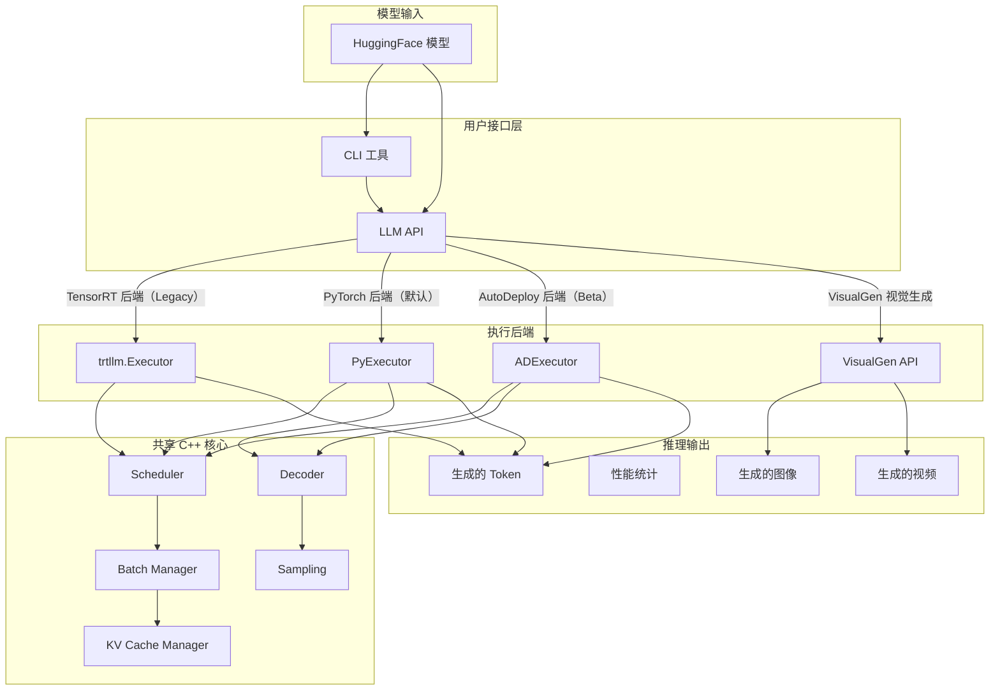

# TensorRT-LLM 软件架构概览

> 基于 commit `5d8a78662f` (Jul 2026) 分析

## 1. 项目概览

TensorRT-LLM 是 NVIDIA 开源的 LLM 推理加速库，支持 **TensorRT 引擎（Legacy）** 和 **PyTorch** 两种后端，以及 **AutoDeploy（Beta）** 自动化部署路径。项目同时扩展支持 **VisualGen** 视觉生成（DiT 图像/视频生成）。

```
项目结构（顶层）：
tensorrt_llm/         # Python 主包
cpp/                  # C++ 核心组件（Scheduler、Decoder、KVCache、Kernels）
tests/                # 测试（单元测试、集成测试）
docs/                 # 文档
examples/             # 使用示例
3rdparty/             # 第三方依赖
docker/               # Docker 构建配置
scripts/              # 工具脚本
benchmarks/           # 基准测试
triton_backend/       # Triton 推理服务器集成
triton_kernels/       # 自研 Triton 内核
```

---

## 2. 整体架构请求流



### 主要执行流程

1. **用户调用** `LLM.generate()` 或通过 CLI (`trtllm-serve`, `trtllm-bench`)
2. **LLM API** (`llmapi/llm.py`) 负责任务分发、tokenizer 管理、请求调度
3. **Executor** 根据后端类型选择合适的执行器
4. **Scheduler**（C++/Python）决定每步调度哪些请求
5. **ModelEngine** 执行模型前向传播
6. **Decoder** 基于模型输出生成下一个 token
7. **Sampler** 对 logits 应用采样策略（greedy、top-k、top-p 等）

---

## 3. 核心 Python 包结构

### 3.1 `tensorrt_llm/llmapi/` — LLM API 入口

| 文件 | 职责 |
|------|------|
| `llm.py` | 主入口 `LLM` 类，提供 `generate()` API |
| `llm_args.py` | 完整 Pydantic 配置模式（~265KB，最大配置文件） |
| `llm_utils.py` | 模型加载、模型特定默认值覆盖 |
| `mpi_session.py` | MPI 多进程会话管理 |
| `disagg_utils.py` | 分离式服务工具函数 |
| `tokenizer.py` | Tokenizer 接口类 |
| `reasoning_parser.py` | 推理内容解析 |
| `thinking_budget.py` | 思考预算 logits 处理器 |
| `mm_encoder.py` | 多模态编码器 |

**配置层次**：
```
BaseLlmArgs → TrtLlmArgs (TensorRT 后端)
            → TorchLlmArgs (PyTorch 后端/AutoDeploy)
```

### 3.2 `tensorrt_llm/executor/` — 执行器抽象层

| 文件 | 职责 |
|------|------|
| `executor.py` | `GenerationExecutor` 基类 |
| `base_worker.py` | Worker 基类（~67KB） |
| `worker.py` | Worker 实现 |
| `proxy.py` | 代理模式Executor（~40KB） |
| `ray_executor.py` | Ray 分布式执行器 |
| `rpc/` | RPC 通信层 |
| `result.py` | 结果类型定义（~61KB） |
| `request.py` | 请求类型定义 |
| `postproc_worker.py` | 后处理 worker |
| `postprocessor_hook.py` | 后处理器 hook |

### 3.3 `tensorrt_llm/_torch/` — PyTorch 后端实现

这是 PyTorch 推理路径的核心代码库。

| 子目录/文件 | 职责 |
|------------|------|
| **`pyexecutor/`** | PyExecutor 核心实现（~2MB 源码） |
| **`models/`** | 所有支持的模型实现（68 个文件） |
| **`modules/`** | 可复用模块（Attention、MLP、Linear、Embedding 等） |
| **`attention_backend/`** | 注意力后端（FlashInfer、FlashAttention、TRTLLM、Vanilla、Sparse） |
| **`auto_deploy/`** | AutoDeploy Beta 功能 |
| **`compilation/`** | 图编译与 piecewise 优化 |
| **`custom_ops/`** | 自定义算子（CUDA、CuTe DSL、Triton） |
| **`distributed/`** | 分布式通信（AllReduce、AllToAll、AllGather） |
| **`speculative/`** | 推测解码（Eagle3、MTP、Medusa、Lookahead 等） |
| **`disaggregation/`** | 分离式服务（native/bounce、nixl、mixers、peer、resource） |
| **`peft/`** | PEFT（LoRA 等）支持 |
| **`kv_cache_compression/`** | KV Cache 压缩 |
| **`quantization/`** | 量化模块 |
| **`visual_gen/`** | 视觉生成实现 |
| `model_engine.py` | PyTorch 模型引擎（~327KB） |
| `model_config.py` | 模型配置（~70KB） |

#### 3.3.1 `pyexecutor/` — PyTorch 执行器核心

| 文件 | 职责 |
|------|------|
| `py_executor.py` | PyExecutor 主循环（~360KB，最大文件之一） |
| `py_executor_creator.py` | 执行器创建工厂 |
| `model_engine.py` | PyTorchModelEngine，模型前向（~327KB） |
| `model_loader.py` | 权重加载器 |
| `resource_manager.py` | 资源管理器（KVCache、词嵌入等）（~136KB） |
| `llm_request.py` | LLM 请求管理（~59KB） |
| `kv_cache_manager_v2.py` | KV Cache 管理器 v2（~149KB） |
| `cuda_graph_runner.py` | CUDA Graph 捕获与重放（~52KB） |
| `config_utils.py` | 配置工具 |
| `scheduler/` | Python 调度器（`scheduler.py` ~84KB, `scheduler_v2.py` ~47KB） |
| `sampler/` | Python 采样器（`sampler.py` ~254KB） |
| `connectors/` | KV Cache 连接器 |

**PyExecutor 单步迭代流**：
```
1. 从请求队列获取新请求
2. Scheduler 确定哪些请求可执行
3. KVCacheManager 分配/准备 KV Cache 资源
4. ModelEngine 执行模型前向（单步）
5. Decoder/Sampler 基于输出生成下一个 token
6. 处理完成请求，返回结果
```

**Overlap Scheduler** 通过流水线 CPU/GPU 重叠隐藏延迟：
```python
# 第 n 步：调度并启动 GPU 工作
scheduled_batch, _, _ = self._schedule()
batch_outputs = self._forward_step(scheduled_batch, previous_tensors_device)
sample_state = self._sample_async(scheduled_batch, batch_outputs)

# GPU 忙碌时，处理上一步的 CPU 工作
if self.previous_batch is not None:
    self._process_previous_batch()
```

#### 3.3.2 `models/` — 模型实现

共实现 **68 个模型文件**，命名规范 `modeling_<model_name>.py`：

| Model | File Size | Notes |
|-------|-----------|-------|
| **LLaMA** | `modeling_llama.py` (~72KB) | LLaMA 系列/派生模型基线 |
| **LLaMA Min Latency** | `modeling_llama_min_latency.py` (~40KB) | 最小延迟优化版本 |
| **DeepSeek V3/V4** | `modeling_deepseekv3.py` (~96KB), `modeling_deepseekv4.py` (~120KB) | MoE 模型 |
| **Qwen2VL / Qwen3VL** | `modeling_qwen2vl.py` (~100KB), `modeling_qwen3vl.py` (~73KB) | 视觉语言模型 |
| **Gemma 3/4** | `modeling_gemma3.py`, `modeling_gemma4.py`, `modeling_gemma4_unified.py` | Google Gemma 系列（Gemma4 含 Audio/Vision/Unified 多模态） |
| **Nemotron** | `modeling_nemotron.py`, `modeling_nemotron_h.py`, `modeling_nemotron_nano.py` (~151KB) | NVIDIA Nemotron（含 Nano 变体） |
| **Mixtral** | `modeling_mixtral.py` | 稀疏 MoE |
| **Phi** | `modeling_phi3.py`, `modeling_phi4mm.py` | Microsoft Phi（含多模态） |
| **MiniMax** | `modeling_minimaxm3.py` (~82KB), `modeling_minimaxm3_vl.py` | 含视觉语言 |
| **Multimodal** | `modeling_multimodal_encoder.py`, `modeling_multimodal_mixin.py`, `modeling_multimodal_utils.py` (~55KB) | 多模态共享组件 |
| **Speculative** | `modeling_speculative.py` (~94KB) | 推测解码基础模型 |
| **DSPark** | `modeling_dspark.py` (~53KB) | 动态稀疏架构 |
| **BART/T5** | `modeling_bart.py` (~27KB), `modeling_t5.py` (~42KB) | Encoder-Decoder 模型 |
| **BERT/CLIP** | `modeling_bert.py` (~17KB), `modeling_clip.py` (~9KB) | 编码器模型 |

**基类**位于 `modeling_utils.py` (~56KB)：
- `PretrainedConfig` — 所有模型配置基类
- `PretrainedModel` — 所有模型基类

**自动发现**通过 `tensorrt_llm/models/automodel.py`，根据 HF config `architectures` 字段解析。

#### 3.3.3 `modules/` — 可复用构建模块

| 文件/目录 | 职责 |
|----------|------|
| `attention.py` (~52KB) | 注意力机制核心实现 |
| `mla.py` (~146KB) | Multi-Head Latent Attention (DeepSeek MLA) |
| `linear.py` (~176KB) | 线性层（含多种量化实现） |
| `mlp.py` | MLP 模块 |
| `gated_mlp.py` (~16KB) | Gated MLP（SwiGLU 等） |
| `embedding.py` | Embedding 层 |
| `rms_norm.py` (~20KB) | RMS Norm（含多种优化变体） |
| `layer_norm.py` | Layer Norm |
| `rotary_embedding.py` | RoPE 旋转位置编码 |
| `fused_moe/` | 融合 MoE 实现 |
| `fused_ops/` | 融合算子（含 `fused_qk_norm_rope_gate.py`、`gelu_tanh_mul_fp4_quant.py` 等） |
| `mamba/` | Mamba 状态空间模型模块 |
| `gemma4/` | Gemma4 特定模块 |
| `fla/` | 线性注意力（FLA）模块 |

**核心指南**：
- `ATTENTION_DEVELOPER_GUIDE.md` — 注意力机制开发指南
- `fused_moe/MOE_DEVELOPER_GUIDE.md` — MoE 开发指南

#### 3.3.4 `attention_backend/` — 注意力后端

| 后端 | 文件 | 说明 |
|------|------|------|
| TRTLLM (默认) | `trtllm.py` (~100KB) | TensorRT-LLM 自研注意力内核 |
| FlashInfer | `flashinfer.py` (~104KB) | FlashInfer 集成 |
| FlashAttention | `fmha/` | Flash Attention 2/3 |
| Vanilla | `vanilla.py` (~31KB) | 基础 PyTorch 注意力 |
| Triton Prefill | `triton_prefill.py` (~24KB) | Triton 实现 |
| StarFlashInfer | `star_flashinfer.py` (~22KB) | Star 注意力 |
| Sparse | `sparse/` | 稀疏注意力（含 SparseAttention (DSA)、Rocket、SkipSoftmax、DeepSeek V4 块稀疏、MiniMax M3 MSA） |

后端由 `TorchLlmArgs.attn_backend` 选择。

### 3.4 `tensorrt_llm/_torch/auto_deploy/` — AutoDeploy（Beta）

AutoDeploy 提供无需修改源码的模型自动部署路径。工作流程：

```
PyTorch/HF 模型 → torch.export → 计算图 → 图变换 → 编译 → TensorRT LLM 运行时
```

| 子目录/文件 | 职责 |
|------------|------|
| `llm.py` | AutoDeploy LLM 入口 |
| `llm_args.py` | AutoDeploy 配置参数 |
| `_compat.py` | 后向兼容层 |
| **`shim/`** | `ad_executor.py` — 适配 PyExecutor 的 AutoDeploy 执行器 |
| **`transform/`** | 图变换引擎 |
| **`export/`** | torch.export 封装 |
| **`config/`** | 配置管理（default.yaml 等） |
| **`compile/`** | 编译后端 |
| **`distributed/`** | 分布式支持 |
| **`models/`** | AutoDeploy 模型适配 |
| **`custom_ops/`** | 自定义算子 |
| **`mlir/`** | MLIR 集成 |
| `trtllm_compat.py` | TRT-LLM 兼容层 |

**图变换管线**（`transform/library/`）：
- 自动分片（Sharding）
- KV Cache 插入
- GEMM 融合
- MHA 融合
- CUDA Graph 优化
- 量化转换

### 3.5 `tensorrt_llm/_torch/speculative/` — 推测解码

支持多种推测解码策略：

| 策略 | 文件 | 说明 |
|------|------|------|
| Eagle3 | `eagle3.py`, `eagle3_dynamic_tree.py` | 第三代 Eagle (~107KB + ~56KB) |
| MTP | `mtp.py` (~50KB) | Multi-Token Prediction |
| Medusa | 通过 `interface.py` | Medusa 推测解码 |
| Lookahead | 通过 `interface.py` | Lookahead 解码 |
| NGram | `ngram.py` | N-Gram 草稿 |
| PARD | `pard.py` (~21KB) | 并行草稿 |
| DFlash | `dflash.py` (~34KB) | 动态草稿 |
| DSPark | `dspark.py` (~27KB) | 动态稀疏 |
| DraftTarget | `draft_target.py` | 草稿-目标模型 |
| SpecSampler | `spec_sampler_base.py` | 推测采样基类 |

### 3.6 `tensorrt_llm/_torch/custom_ops/` — 自定义算子

| 文件 | 说明 |
|------|------|
| `torch_custom_ops.py` (~110KB) | PyTorch 自定义算子组合 |
| `cute_dsl_custom_ops.py` (~355KB) | CuTe DSL 自定义算子（最大文件之一） |
| `cpp_custom_ops.py` (~59KB) | C++ 后端的自定义算子 |
| `trtllm_gen_custom_ops.py` (~100KB) | TRT-LLM 生成算子 |
| `cute_dsl_megamoe_custom_op.py` (~64KB) | MegaMoE CuTe DSL 算子 |
| `flashinfer_custom_ops.py` | FlashInfer 集成算子 |
| `cutedsl_matmul_heuristics.py` | CuTe DSL MatMul 启发式 |
| `fast_custom_op.py` | 快速自定义算子基类 |

### 3.7 `tensorrt_llm/_torch/distributed/` — 分布式通信

| 文件 | 说明 |
|------|------|
| `communicator.py` (~46KB) | MPI 通信器封装 |
| `ops.py` (~56KB) | 分布式通信算子（AllReduce、AllGather 等） |
| `moe_alltoall.py` (~22KB) | MoE All-to-All 通信 |
| `symm_mem_allgather.py` | 对称内存 AllGather |
| `symm_mem_allreduce.py` | 对称内存 AllReduce |
| `allreduce_helper.py` | AllReduce 辅助工具 |

支持 TP（Tensor Parallelism）、PP（Pipeline Parallelism）、EP（Expert Parallelism）。

### 3.8 `tensorrt_llm/serve/` — 推理服务

| 文件 | 说明 |
|------|------|
| `openai_server.py` (~126KB) | OpenAI 兼容 REST API 服务端 |
| `router.py` (~86KB) | 请求路由 |
| `responses_utils.py` (~81KB) | 响应处理工具 |
| `openai_protocol.py` (~73KB) | OpenAI 协议定义 |
| `harmony_adapter.py` (~84KB) | Harmony 适配器 |
| `disagg_coordinator.py` (~29KB) | 分离式服务协调器 |
| `resource_governor.py` | 资源管理 |
| `chat_utils.py` | 聊天工具函数 |

### 3.9 `tensorrt_llm/commands/` — CLI 命令

| 文件 | 说明 |
|------|------|
| `serve.py` (~98KB) | `trtllm-serve` 命令实现 |
| `bench.py` | `trtllm-bench` 基准测试命令 |
| `eval.py` | `trtllm-eval` 评估命令 |
| `utils.py` | CLI 工具函数 |

### 3.10 `tensorrt_llm/quantization/` — 量化

| 文件 | 说明 |
|------|------|
| `quantize_by_modelopt.py` (~54KB) | ModelOpt 量化主逻辑 |
| `mode.py` | 量化模式定义 |
| `modelopt_config.py` | ModelOpt 配置 |
| `functional.py` | 量化函数 |
| `utils/` | 量化工具 |

### 3.11 `tensorrt_llm/models/` — TensorRT 后端的模型基类

| 文件 | 说明 |
|------|------|
| `automodel.py` | 自动模型发现与注册 |
| `modeling_utils.py` (~23KB) | PretrainedConfig/PretrainedModel 基类 |
| `convert_utils.py` (~24KB) | 模型转换工具 |
| `unet/` | UNet 模块（视觉生成） |

### 3.12 `tensorrt_llm/visual_gen/` — 视觉生成公共 API

| 文件 | 说明 |
|------|------|
| `visual_gen.py` | VisualGen 主入口 |
| `args.py` (~25KB) | VisualGen 参数 |
| `params.py` | VisualGen 参数配置 |
| `output.py` | 输出类型（图像/视频） |
| `sparse_attention.py` | 稀疏注意力配置 |

### 3.13 `tensorrt_llm/_torch/visual_gen/` — 视觉生成内部实现

| 文件/目录 | 说明 |
|----------|------|
| `executor.py` (~45KB) | DiffusionExecutor 实现 |
| `pipeline.py` (~53KB) | Diffusion 管线基类 |
| `pipeline_loader.py` (~15KB) | 管线加载 |
| `config.py` (~30KB) | VisualGen 配置 |
| `output.py` | 输出处理 |
| `models/` | 各扩散模型实现 |
| `modules/` | 扩散模块 |
| `cache/` | 缓存管理 |
| `attention_backend/` | 扩散注意力后端 |
| `quantization/` | 扩散量化 |

---

## 4. C++ 核心技术栈

`cpp/tensorrt_llm/` 目录结构：

| 子目录 | 说明 |
|-------|------|
| **`batch_manager/`** | 批量调度管理器、KV Cache 管理器（`kvCacheManager.cpp` ~216KB） |
| **`executor/`** | C++ Executor 配置、序列化（`serialization.cpp` ~123KB） |
| **`kernels/`** | CUDA 内核实现（大量 .cu/.cuh 文件） |
| **`runtime/`** | 运行时组件（Decoder、Buffer、IPC、通信） |
| **`layers/`** | 神经网络层实现 |
| **`common/`** | 通用工具 |
| **`nanobind/`** | Python-C++ 绑定（Nanobind） |
| **`cutlass_extensions/`** | CUTLASS 扩展 |
| **`thop/`** | TensorRT 操作实现 |
| **`testing/`** | 测试代码 |
| **`deep_ep/`** | DeepEP 专家并行 |
| **`deep_gemm/`** | DeepGEMM 矩阵乘法 |
| **`flash_mla/`** | Flash MLA 内核 |

### 通过 Nanobind 共享的关键 C++ 组件

Python 后端和 TensorRT 后端共享的 C++ 组件：

```
PyExecutor → Nanobind → Scheduler（CapacityScheduler + MicroBatchScheduler）
PyExecutor → Nanobind → Decoder（gptDecoder、gptDecoderBatched）
PyExecutor → Nanobind → KVCacheManager（kvCacheManager）
```

---

## 5. 模型架构模式

### 5.1 模型定义模式

每个模型遵循两个类的模式：
```python
# 1. 配置类（继承 PretrainedConfig）
class LLaMAConfig(PretrainedConfig):
    hidden_size: int = 4096
    num_attention_heads: int = 32
    num_hidden_layers: int = 32
    # ...

# 2. 主模型类（继承 PretrainedModel）
class LLaMAForCausalLM(PretrainedModel):
    def __init__(self, config):
        self.model = LLaMAModel(config)
        self.lm_head = nn.Linear(config.hidden_size, config.vocab_size)

    def forward(self, input_ids, position_ids, past_key_values=None, ...):
        # 模型前向逻辑
        pass
```

### 5.2 自动注册机制

模型通过 `tensorrt_llm/models/automodel.py` 自动注册，由 HF 配置的 `architectures` 字段解析。

### 5.3 配置层次

```
BaseLlmArgs
  ├── TrtLlmArgs（TensorRT 后端，旧版）
  └── TorchLlmArgs（PyTorch 后端，默认）
        ├── attn_backend: TRTLLM / FlashInfer / FlashAttention
        ├── moe_config: MoE 配置
        ├── cuda_graph: CUDA Graph 配置
        ├── speculative_config: 推测解码配置
        └── ...（数百个 Pydantic 字段）
```

---

## 6. 分布式与并行策略

| 策略 | 说明 |
|------|------|
| **Tensor Parallelism (TP)** | 张量分片，通过 `Mapping` 类管理，支持多种通信后端（MPI、NCCL、Ray、RPC） |
| **Pipeline Parallelism (PP)** | 流水线并行（旧版支持） |
| **Expert Parallelism (EP)** | 专家并行（DeepSeEP） |
| **Context Parallelism (CP)** | 上下文并行（Ring Attention） |

### 通信层
- `tensorrt_llm/_torch/distributed/communicator.py` — Python 通信器
- `cpp/tensorrt_llm/runtime/ncclCommunicator.cpp` — C++ NCCL 通信器
- `cpp/tensorrt_llm/runtime/mcastDeviceMemory.*` — 多播设备内存

---

## 7. 测试架构

| 测试层 | 位置 | 说明 |
|-------|------|------|
| 单元测试 | `tests/unittest/` | 预合并 CI 运行；部分需要 GPU |
| API 稳定性 | `tests/unittest/api_stability/` | 保护已提交的 API 签名 |
| 集成测试 | `tests/integration/defs/` | 需要 GPU + `LLM_MODELS_ROOT` |
| Torch 测试 | `tests/torch/` | PyTorch 后端专项测试 |
| 测试列表 | `tests/integration/test_lists/test-db/` | 按 GPU 类型分 YAML（`l0_a10.yml`、`l0_h100.yml` 等） |
| 豁免列表 | `tests/integration/test_lists/waives.txt` | 跳过已知失败用例 |

---

## 8. 关键设计模式

| 模式 | 关键点 |
|------|--------|
| **配置层次** | `BaseLlmArgs` → `TrtLlmArgs` / `TorchLlmArgs`，模型特定默认值覆盖通用默认值，Pydantic 验证 |
| **模型架构** | 每个模型：`Config`（继承 `PretrainedConfig`）+ `ForCausalLM`（继承 `PretrainedModel`） |
| **模型默认值** | 架构特定的默认值覆盖在 `llm_utils.py`（注意力内核、量化、推测解码、缓存等） |
| **注意力后端** | `TorchLlmArgs.attn_backend` 选择内核：`TRTLLM`（默认）、`FlashInfer`、`FlashAttention` |
| **分布式执行** | 通过 `Mapping` 类的 TP/PP，多种后端（MPI、Ray、RPC） |
| **自动发现** | 模型通过 `automodel.py` 自动注册，通过 HF config `architectures` 字段解析 |

---

## 9. 关键反模式

- **Pre-commit 会就地修改文件** — 如果钩子失败，文件已修改。重新 `git add` 并再次提交
- **受保护的 API ** — 更改 LLM API 签名将导致 `tests/unittest/api_stability` 测试失败，需要代码所有者审查
- **集成测试需要 GPU + 模型** — 始终设置 `LLM_MODELS_ROOT` 并确保 GPU 访问。单元测试不需要
- **避免宽泛的异常处理** — 捕获特定异常，而不是裸 `except:`
- **一个 PR 关注一个关注点** — 避免范围蔓延
- **TensorRT 后端是旧版** — `TrtLlmArgs` / `backend="tensorrt"` 是旧版；新功能针对 PyTorch 或 AutoDeploy

---

## 10. 后端总结矩阵

| 后端 | 状态 | 入口 | 关键路径 |
|------|------|------|---------|
| **PyTorch** | **默认** | `TorchLlmArgs` | `_torch/pyexecutor/` → `PyExecutor` → PyTorch Engine |
| **AutoDeploy** | Beta | `_torch/auto_deploy/` shim | `shim/ad_executor.py` → 适配 `PyExecutor` → 图变换 + `torch.export` |
| **TensorRT** | 旧版 | `TrtLlmArgs` | `builder.py` → `trtllm.Executor` → TensorRT Engine |

## 11. 工具命令

| 命令 | 用途 |
|------|------|
| `trtllm-serve` | OpenAI 兼容 REST + gRPC 服务器，支持所有后端 |
| `trtllm-bench` | 吞吐量/延迟基准测试 |
| `trtllm-eval` | 模型评估 |
| `trtllm-llmapi-launch` | LLM API 启动器 |

---

**文档创建时间**: 2026-07-23  
**最后更新**: 2026-07-23  
**基于**: TensorRT-LLM 代码快照（含 NVIDIA upstream 至 Jul 2026）
